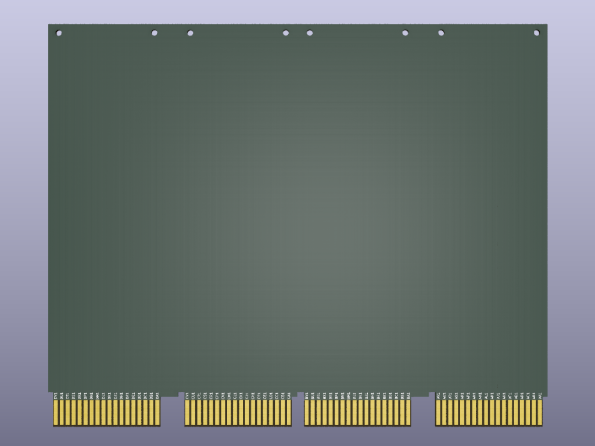

# KiCAD Templates for DEC FLIP CHIP Modules

This repo contains KiCAD templates for building boards that are physically
compatible with Digital Equipment Corporation's FLIP CHIP modules.
[FLIP CHIP modules](https://en.wikipedia.org/wiki/Flip_Chip_(PDP_module)) were used in a range
of DEC computer systems, including the PDP-7, PDP-8, PDP-9, PDP-10, PDP-11 and VAX.  For PDP-11s,
they define the standard form-factor for modules that plug into the system's UNIBUS or QBUS backplanes.

These templates were designed to match the physical specifications found in the
[Digital Logic Handbook 1975-76](http://www.bitsavers.org/pdf/dec/handbooks/Digital_Logic_Handbook_1975-76.pdf), pp 6-10.
Where authoritative specifications were unavailable (such as the width for hex-height boards) dimensions
were taken from actual hardware.

Five templates are provided, corresponding to the most popular configurations:

* `DEC-FLIP-CHIP-SINGLE-STD-template` – Single-height, standard-length module
* `DEC-FLIP-CHIP-DOUBLE-EXT-template` – Double-height, extended-length module
* `DEC-FLIP-CHIP-QUAD-EXT-template` – Quad-height, extended-length module
* `DEC-FLIP-CHIP-QUAD-EXT-CF-template` – Quad-height, extended-length module, connectors labeled C-F
* `DEC-FLIP-CHIP-HEX-EXT-template` – Hex-height, extended-length module

Two variants of the quad-height template are included–one with edge connectors labeled A
through D (as used for PDP-11 QBUS modules) and one with connectors labeled C through F
(as used for PDP-11 UNIBUS SPC modules).

In addition, KiCAD libraries are included containing schematic symbols and corresponding
footprints for the various sizes of edge connectors.  These are labeled with the standard DEC
alphanumeric numbering scheme.

## Building DEC compatible PCBs

When building PCBs intended to be used in DEC systems, it is recommended to request the following
manufacturing options:

* ENIG or hard gold surface finish
* Beveled connector edges
* Board thickness 1.4mm to 1.6mm

Board thicknesses of 1.6mm are commonly offered by modern PCB manufacturers.  DEC's specifications call
for boards to be .056" (+/-0.005) thick, which makes 1.6mm a little big.  In practice, 1.6mm boards have
been successfully used in many instances, including for modules that plug into PDP-11 UNIBUS and QBUS
backplanes.

To ensure durability of the edge connectors against repeated insertions/removals, a hard gold surface
finish preferred.  Unfortunately, this can be quite expensive, and is not offered by many PCB manufactures.
ENIG is a more affordable, if less durable, compromise that has been used successfully in a number of
examples.

## License

The dec-flip-chip-templates project, including the schematics, PCB layouts, all associated documentation
and this README, are licensed under a [Creative Commons Attribution 4.0 International License](https://creativecommons.org/licenses/by/4.0/).  The file `LICENSE.TXT` contains a copy these provisions.
